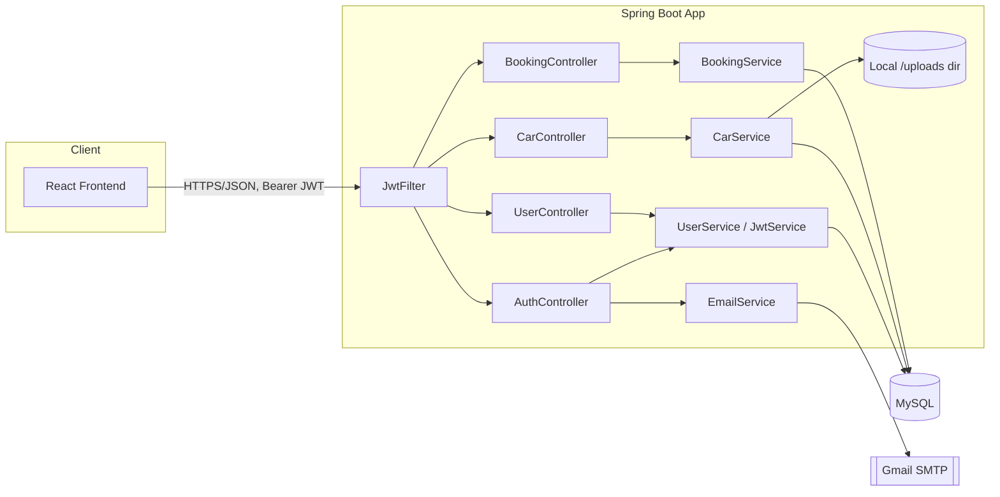
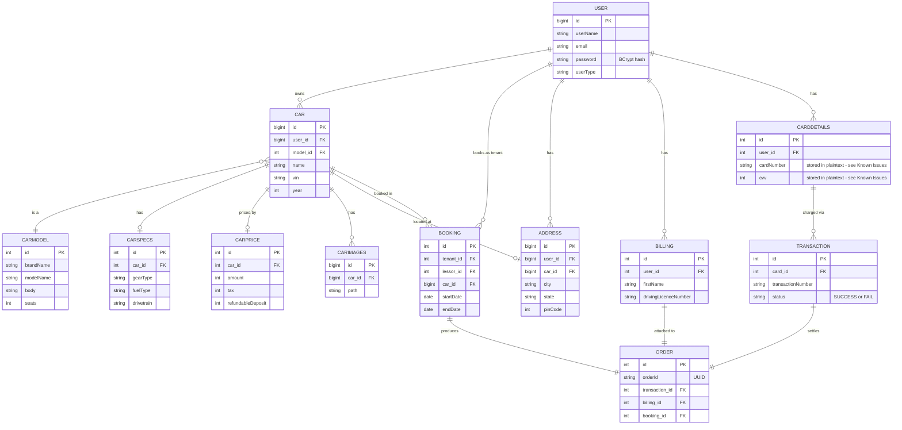
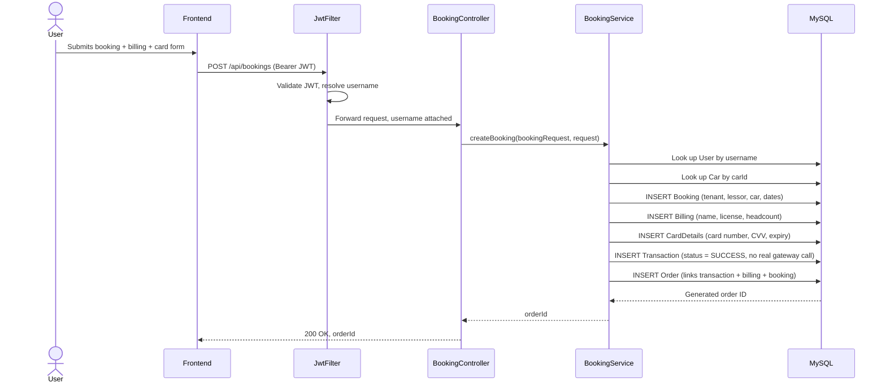

# Architecture

## System overview

This is a single-module Spring Boot application: REST controllers accept JSON/multipart requests, delegate to service classes for business logic, and Spring Data JPA repositories persist to MySQL. Authentication is stateless — a client logs in once via `/api/auth/login`, gets back a JWT, and attaches it as `Authorization: Bearer <token>` on every subsequent call. A servlet filter (`JwtFilter`) validates that token on each request and populates Spring Security's context before the request reaches a controller. Uploaded car images are written to a local `/uploads` directory on the server's filesystem and served back through a dedicated endpoint rather than a CDN/object store. Outbound registration emails go through Gmail SMTP via Spring Mail.

This backend is the counterpart to a separate React frontend (`Car-Rental-Frontend`), which calls exactly the route prefixes documented below (`/api/auth`, `/api/cars`, `/api/bookings`, `/api/users/expired`) against a deployed instance of this service.

## Architecture diagram

## Database schema

12 JPA entities map to 12 MySQL tables (confirmed against the schema dump in `output.sql`). Two additional entities (`Document`, `Place`) exist in code but have no repository or controller wiring them up — they're unused leftovers, omitted from the diagram below.

`CarModel`/`CarSpecs`/`CarPrice` are split out from `Car` so the same car model can vary independently in trim and pricing; `Booking`, `Billing`, `CardDetails`, `Transaction`, and `Order` are split into one row per concern of a single checkout rather than one wide table — `Order` is effectively the join record that ties a booking to its billing info and payment transaction. See `output.sql` for the full column list, including the Hibernate-generated `*_seq` sequence tables.

## Folder-by-folder breakdown

| Path | Contents | Why |
|---|---|---|
| `config/` | `SecurityConfig` (JWT filter chain, permit-all routes), `WebConfig` (global CORS), `MailConfig` (SMTP bean) | Cross-cutting setup that isn't tied to one resource |
| `controller/` | `AuthController`, `CarController`, `BookingController`, `UserController`, `TestController` | One `@RestController` per resource; thin — they extract the authenticated username from the request and hand off to a service |
| `model/table/` | 12 `@Entity` classes (`User`, `Car`, `CarModel`, `CarSpecs`, `CarPrice`, `CarImages`, `Address`, `Booking`, `Billing`, `CardDetails`, `Transaction`, `Order`) plus 2 unused (`Document`, `Place`) | This *is* the database schema — Hibernate generates/updates tables from these via `spring.jpa.hibernate.ddl-auto=update` |
| `model/requestModel/` | `CarRequest`/`CarResponse`/`CarResponseWithUser`, `BookingRequest`/`BookingResponse` | DTOs that shape the multipart/JSON request and response bodies separately from the persistence entities |
| `model/UserPrincipal.java` | Adapts `User` to Spring Security's `UserDetails` | Bridges the JPA entity into the auth framework |
| `repository/` | One Spring Data JPA interface per entity (11 repositories; `Document`/`Place` have none) | Standard repository-per-aggregate pattern; a few (e.g. `CarImagesRepository`, `CarRepository`) add custom finder methods |
| `service/` | `UserService` (register/update/lookup), `JwtService` (token issue/validate), `JwtFilter` (per-request auth), `MyUserDetailsService` (Spring Security lookup), `CarService` (car CRUD + image upload to disk), `BookingService` (multi-entity checkout), `EmailService` (registration email) | Business logic layer; controllers stay thin |

## Request lifecycle: creating a booking

The booking flow is the most representative multi-step operation in the app — it touches five tables in one call.

Note that `Transaction.status` is hardcoded to `SUCCESS` in `BookingService.createBooking` — there is no integration with a real payment gateway; the "transaction" is a database record only.

## Known limitations

See the [Known Issues](./README.md#known-issues) section in the README — it covers the security and code-quality findings from this scan (hardcoded mail credentials, plaintext card storage, missing ownership checks, no role enforcement, committed build artifacts, no tests/CI) so they aren't duplicated here.
